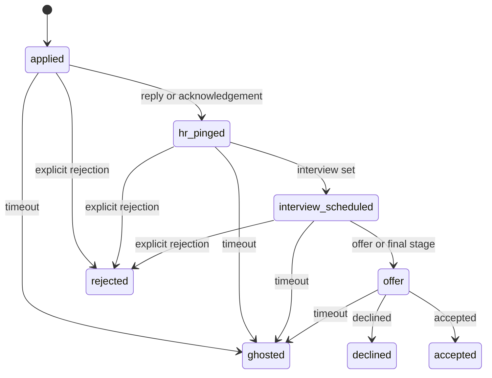

# v5 Application Lifecycle (TASK-071, TASK-083, EPIC-17)

**Scope:** Define the minimal single-user application lifecycle and additive Postgres schema for RoleForge v5. This locks the decision behind `TASK-071` and provides the contract for `TASK-083`. No separate service, no calendar sync, and no AI-gated state transitions.

**Refs:** `docs/research-v4-plus.md` §4.2, §5.5, §6.1; `docs/architecture.md`; `docs/specs/ai-enrichment-contract.md`; `docs/specs/deployment-runtime.md`.

---

## 1. Decision summary

- Application tracking stays in the same Postgres database as the rest of the MVP.
- Application state changes are operator-confirmed, with Telegram as the UX surface.
- AI is advisory only and remains post-scoring.
- The migration file is `schema/004_application_lifecycle.sql` because `schema/003_ai_metadata.sql` already exists.

---

## 2. Lifecycle model

### 2.1 States

| State | Meaning | Terminal |
| --- | --- | --- |
| `applied` | The operator has applied to the vacancy. | No |
| `hr_pinged` | An employer reply or acknowledgement has been observed. | No |
| `interview_scheduled` | An interview or next-step meeting has been scheduled. | No |
| `offer` | A formal offer or final offer-stage discussion exists. | No |
| `rejected` | The employer closed the process without an offer. | Yes |
| `ghosted` | The employer stopped responding after a timeout window. | Yes |
| `accepted` | The operator accepted the offer. | Yes |
| `declined` | The operator declined the offer. | Yes |

### 2.2 Canonical progression

The canonical flow is:

- Direct jumps to a later state are allowed when the employer signal is explicit, so the operator does not have to click through empty intermediate states.
- `rejected` and `ghosted` are the pre-offer terminal exits.
- `accepted` and `declined` are only valid after the `offer` stage.
- No state is automatically inferred by AI; AI can help classify a message later, but the state update remains deterministic and operator-visible.

---

## 3. Schema plan

The v5 schema is additive only. It introduces three tables and keeps the current Postgres source of truth model intact.

| Table | Purpose | Key columns |
| --- | --- | --- |
| `applications` | One row per applied profile match. | `profile_match_id`, `vacancy_id`, `status`, `applied_at`, `notes`, `created_at`, `updated_at` |
| `employer_threads` | Gmail conversation tracking for application-related replies. | `application_id`, `gmail_thread_id`, `company_domain`, `last_message_at`, `classification`, `created_at` |
| `interview_events` | Timeline entries for interviews, offers, and related next steps. | `application_id`, `event_type`, `scheduled_at`, `notes`, `created_at` |

### 3.1 `applications`

- `profile_match_id UUID NOT NULL REFERENCES profile_matches (id) ON DELETE CASCADE`
- `vacancy_id UUID NOT NULL REFERENCES vacancies (id) ON DELETE CASCADE`
- `status TEXT NOT NULL DEFAULT 'applied' CHECK (...)`
- `applied_at TIMESTAMPTZ NOT NULL DEFAULT now()`
- `notes JSONB`
- `created_at TIMESTAMPTZ NOT NULL DEFAULT now()`
- `updated_at TIMESTAMPTZ NOT NULL DEFAULT now()`

**Status values:** `applied`, `hr_pinged`, `interview_scheduled`, `offer`, `rejected`, `ghosted`, `accepted`, `declined`.

### 3.2 `employer_threads`

- `application_id UUID NOT NULL REFERENCES applications (id) ON DELETE CASCADE`
- `gmail_thread_id TEXT`
- `company_domain TEXT`
- `last_message_at TIMESTAMPTZ`
- `classification JSONB`
- `created_at TIMESTAMPTZ NOT NULL DEFAULT now()`

`classification` is bounded metadata for later inbox-classification work, such as the message class, confidence, and last classification timestamp.

### 3.3 `interview_events`

- `application_id UUID NOT NULL REFERENCES applications (id) ON DELETE CASCADE`
- `event_type TEXT NOT NULL CHECK (...)`
- `scheduled_at TIMESTAMPTZ`
- `notes JSONB`
- `created_at TIMESTAMPTZ NOT NULL DEFAULT now()`

**Event values:** `hr_call`, `technical`, `panel`, `offer`, `assessment`, `reference`, `other`.

### 3.4 Indexes

- `applications(profile_match_id)`
- `applications(status)`
- `employer_threads(application_id)`
- `employer_threads(gmail_thread_id)`
- `interview_events(application_id)`
- `interview_events(scheduled_at)`

### 3.5 Audit and auditability

- No separate history table is added in this block.
- The combination of `applications.updated_at`, `employer_threads`, and `interview_events` is enough for the first MVP pass.
- The system remains replayable because the source of truth stays in Postgres.

---

## 4. Operator flow

1. The operator marks a vacancy as applied from the review queue, creating an `applications` row.
2. Employer replies are correlated through Gmail thread IDs and stored in `employer_threads`.
3. When the thread contains an interview signal, the operator or later automation records an `interview_events` row.
4. Telegram remains the control surface for confirming status changes.
5. Any later AI assistance is bounded to classification or extraction, and only after scoring.

---

## 5. Deferred scope

- No Google Calendar sync in v5.
- No separate application service or database.
- No dual-provider AI path.
- No automatic AI-driven lifecycle transitions.
- No inbox classifier implementation in this block; that starts with `TASK-072` and `TASK-073`. The `gmail_messages.classified_as` column (migration `005_gmail_classified.sql`) stores the result; semantics and deterministic rules are in [Inbox classifier](inbox-classifier.md).

---

## 6. Implementation path

| Task | Role in this slice |
| --- | --- |
| `TASK-071` | Finalize the state machine and schema direction. |
| `TASK-072` | Add `classified_as` to `gmail_messages` once the lifecycle contract is fixed. |
| `TASK-073` | Design the deterministic inbox classifier. |
| `TASK-074` | Define the AI fallback contract for ambiguous emails. → [AI inbox classification contract](ai-inbox-classification-contract.md). |
| `TASK-075` | Implement the inbox classifier module. → `roleforge.inbox_classifier`. |
| `TASK-076` | Run inbox classification as a job. |
| `TASK-077` | Create employer thread records. |
| `TASK-078` | Implement state transitions via Telegram actions. |
| `TASK-079` | Extract interview events from employer emails. |
| `TASK-080` | Notify Telegram on application updates. |
| `TASK-081` | Add the company briefer AI output. |
| `TASK-082` | Add the prep checklist AI output. |
| `TASK-083` | Publish this lifecycle spec and keep it aligned with the schema. |
